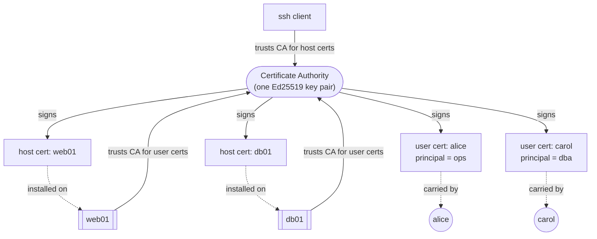
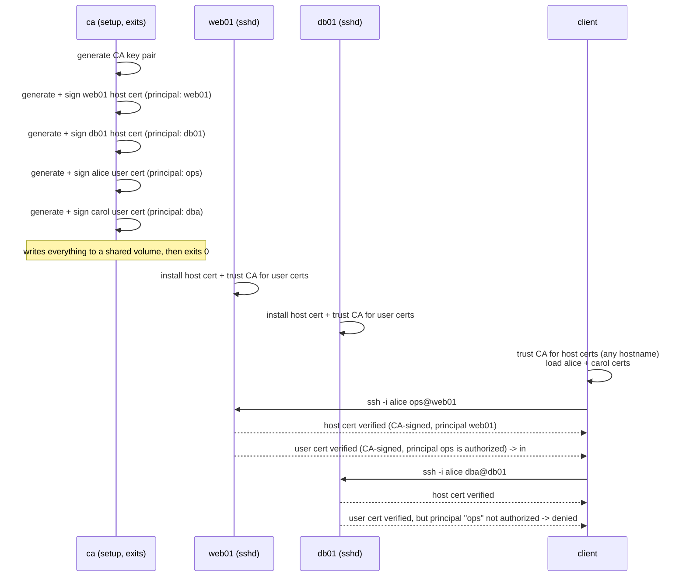

# ssh-certs-PoC

A minimal, runnable illustration of **SSH certificate authentication**: one
certificate authority, two "servers", one client, and a guided script that
shows what changes when SSH trust is delegated to a CA instead of managed
key by key.

Everything runs in small Alpine containers over a Docker network. There is
nothing here that needs a real VM - SSH certificates are a property of the
`ssh`/`sshd` protocol, not of the machines running it.

## The problem

Plain SSH key auth asks two independent, unrelated questions every time you
connect, and answers both of them badly at scale:

**"Is this really the server I think it is?"** - answered by `known_hosts`.
The first time you connect to a new host, you get a Trust-On-First-Use
prompt asking you to just believe the key it's showing you. Every host you
touch adds an entry. Rebuild the host and the key changes, so every client
that ever connected to it now needs to be told again.

**"Should this server let this person in?"** - answered by
`authorized_keys`. Every host that anyone needs to reach must have that
person's public key appended to some account's `authorized_keys` file.
Someone joins the team: every relevant host needs an edit. Someone leaves,
or a key is compromised: every host needs the corresponding edit, and
you'd better not miss one. Keys don't expire on their own, so a forgotten
entry is a standing liability.

Both problems have the same shape: an *N x M* web of trust decisions
(N hosts, M users/clients) that has to be kept in sync by hand, or by
whatever config-management tooling you've built to paper over it.

## The concept

An SSH certificate authority collapses that *N x M* web into two *N + M*
relationships, by having one party everyone already trusts vouch for
everyone else:



Two independent certificate types come out of the same mechanism:

- **Host certificates** let a client verify a server without a per-host
  `known_hosts` entry. The client trusts one CA public key, once, for every
  hostname pattern it covers - no more "authenticity of host ... can't be
  established".
- **User certificates** let a server verify a client without a per-user
  `authorized_keys` entry. The server trusts one CA public key, once, and
  decides what any given certificate is allowed to do based on what's
  written *inside* it - not on whether someone remembered to paste a key
  somewhere.

That "what's written inside it" part matters as much as the signature
itself:

- **Principals** are a role or identity string the CA attests to (`ops`,
  `dba`, a hostname, ...). A server maps *its own local accounts* to the
  principals it will accept for them (`AuthorizedPrincipalsFile`). Alice's
  certificate proves she's "ops"; whether "ops" can log in as anything on a
  given host is that host's decision, not hers.
- **Validity windows** (`-V`) give every certificate a built-in expiry.
  Unlike a key in `authorized_keys`, a certificate doesn't need to be
  found and deleted to stop working - it just stops working.
- **Key IDs** (`-I`) are a free-text label baked into the certificate and
  logged by `sshd` on every use, so "who did this" doesn't depend on
  which shared key happened to be used.

The trade is: everything now depends on the CA private key. Protecting
*one* key well is a much smaller problem than keeping *N x M* trust
decisions consistent, but it does mean the CA key deserves real scrutiny -
see [docs/production.md](docs/production.md) for how that's handled outside
a demo repo.

The diagram above shows *what* each side trusts. For exactly *how* that
trust gets checked, in protocol order, both directions, see
[docs/validation.md](docs/validation.md) - including why a host
certificate's principal is not a DNS name, and what that means if you're
running on static `/etc/hosts` entries instead of real DNS.

## What's actually running



Four containers, one Docker network, one shared volume acting as the "out
of band" channel a real CA would use config management for:

| Service | Role |
|---|---|
| `ca` | Generates the CA key pair, issues + signs all host and user certificates, then exits. Everything else waits for it to finish. |
| `web01` | An sshd host. Presents a CA-signed host certificate; only accepts user certificates carrying principal `ops`. |
| `db01` | Same, but only accepts principal `dba`. |
| `client` | An ssh client holding two user certificates (alice/`ops`, carol/`dba`) and trusting the CA for host verification. |

## Quick start

```sh
docker compose up --build -d
docker compose exec client demo.sh
```

`demo.sh` walks through, in order:

1. `alice` (principal `ops`) connecting to `web01` - succeeds.
2. `carol` (principal `dba`) connecting to `db01` - succeeds.
3. `alice` (principal `ops`) connecting to `db01` - **denied**. Her
   certificate is entirely valid and CA-signed; it's just not authorized
   for that account. This is the authentication-vs-authorization split
   that principals + `AuthorizedPrincipalsFile` give you.
4. A note on the host-trust prompts that never appeared, and why.
5. `ssh-keygen -Lf` dumping a certificate's contents in full.

To poke around by hand instead:

```sh
docker compose exec client sh

ssh -i /root/.ssh/alice ops@web01
ssh -i /root/.ssh/carol dba@db01
ssh -i /root/.ssh/alice dba@db01      # denied - wrong principal

ssh-keygen -Lf /root/.ssh/alice-cert.pub   # inspect a user cert
ssh-keygen -Lf /root/.ssh/carol-cert.pub
```

Tear down (and wipe the generated CA/keys, stored only in the named
`shared` volume):

```sh
docker compose down -v
```

## Repo layout

```
docker-compose.yml   4 services: ca, web01, db01, client
ca/                  generates the CA key, issues + signs every certificate
hosts/               generic sshd image, parameterised by HOST_NAME / ALLOWED_PRINCIPAL
client/              ssh client image + entrypoint.sh + demo.sh
docs/
  validation.md       how the client/server validation actually works, protocol-by-protocol
  cheatsheet.md       every ssh-keygen flag used here, explained
  production.md       what's simplified for a demo, and what real CAs do instead
```

## Why containers, why docker compose

Nothing about SSH certificates cares what the "hosts" are made of - `sshd`
only needs a host key, a host certificate, and `TrustedUserCAKeys` pointing
at a CA public key; the client only needs `known_hosts` to carry a
`@cert-authority` line. That's it. Containers give this the smallest
possible footprint that still behaves like separate machines:

- Each service gets its own filesystem, process space, and hostname, so
  "host key belongs to host X" is a real, physical thing here, not a
  simulation.
- Docker Compose's default network resolves service names as hostnames for
  free, which is exactly the namespace host certificate principals need
  to match against - no separate DNS or `/etc/hosts` wiring required.
- Everything is disposable: `docker compose down -v` removes the CA and
  every issued certificate, so re-running the demo starts from a clean
  trust root every time.

A raw VM (or three) would demonstrate the identical mechanism with far more
setup and teardown cost and nothing gained - there's no kernel-level,
networking-level, or hardware-level behavior under test here, only
`sshd`/`ssh` configuration. If you outgrow this and want a closer-to-real
setup, the natural next step is running the same images against actual
separate hosts, or trying one of the signing services in
[docs/production.md](docs/production.md).

## Further reading

- [docs/validation.md](docs/validation.md) - exactly how the client
  validates the server and the server validates the client, in protocol
  order, and whether certificates depend on DNS (they don't).
- [docs/cheatsheet.md](docs/cheatsheet.md) - every `ssh-keygen` flag used
  in this repo, explained.
- [docs/production.md](docs/production.md) - what's simplified here, and
  what real-world CA setups (step-ca, Vault, Teleport, BLESS) do instead.
- [OpenSSH `ssh-keygen(1)`](https://man.openbsd.org/ssh-keygen.1) - the
  `CERTIFICATES` section is the primary source for all of this.

## Scope

This is a private, educational proof of concept. Keys/certs are generated
fresh on every `docker compose up`, live only in a local Docker volume, and
are not meant to protect anything real.

## Chapters

This repo uses branches as chapters, each one building on the last:

| Chapter | Branch | Adds |
|---|---|---|
| 0 | [main](https://github.com/gitmpr/ssh-certs-PoC/tree/main) (this branch) | CA, host certificates, user certificates, principals |
| 1 | [1_revocation](https://github.com/gitmpr/ssh-certs-PoC/tree/1_revocation) | Key revocation lists; a raw-keys comparison stack |
| 2 | [2_short-lived_secrets](https://github.com/gitmpr/ssh-certs-PoC/tree/2_short-lived_secrets) | On-demand, short-lived certificate issuance; separate CAs per environment |

up next: [**1_revocation**](https://github.com/gitmpr/ssh-certs-PoC/tree/1_revocation)
